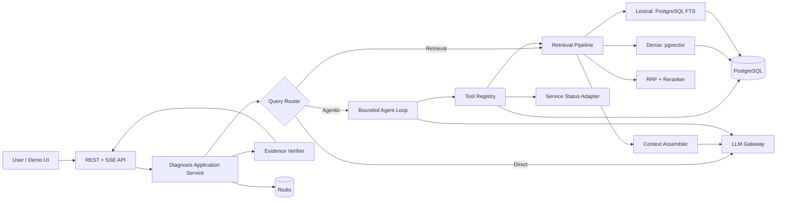
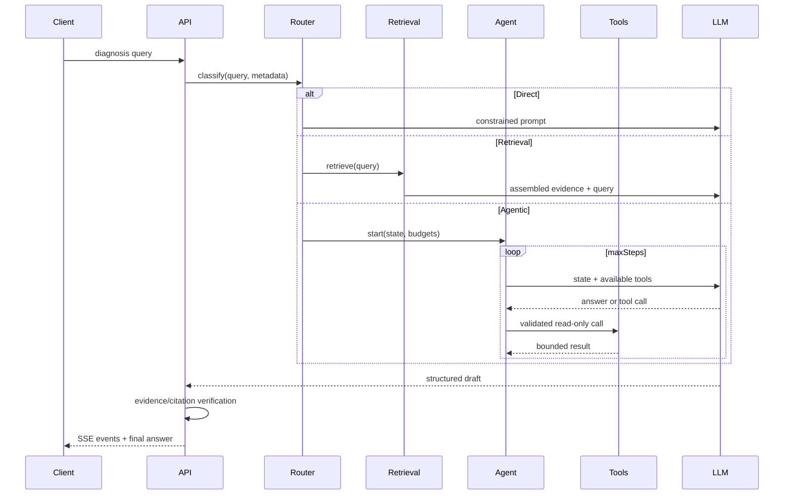

# IncidentPilot 架构

## 架构原则

- 模块化单体优先：一周 MVP 避免分布式复杂度，但模块边界可测试、可替换。
- 领域接口在内层，Spring AI、数据库和模型供应商在适配器层。
- Retrieval、Routing、RRF、Rerank、Agent lifecycle、Evaluation 均由应用代码显式编排。
- 离线摄取与在线问答分离；评测复用生产检索接口。

## 第一版目录结构

```text
incidentPilot/
├── docs/                         # 唯一可信的项目状态
├── src/main/java/.../incidentpilot/
│   ├── IncidentPilotApplication.java
│   ├── common/                   # 错误、时间、配置、观测
│   ├── knowledge/                # 文档摄取、切分、索引
│   ├── retrieval/                # Retriever、Dense/Lexical/Hybrid/Rerank
│   ├── diagnosis/                # 用例、路由、上下文、证据、回答
│   ├── agent/                    # Loop、状态、步骤预算
│   ├── tool/                     # 工具契约、注册、审计与适配器
│   ├── incident/                 # 历史事故
│   ├── deployment/               # 发布与变更
│   ├── servicehealth/            # 服务状态
│   ├── evaluation/               # 数据集、运行器、指标
│   └── api/                      # REST/SSE DTO 与 Controller
├── src/main/resources/
│   ├── db/migration/             # Flyway
│   ├── evaluation/               # 版本化评测集
│   └── application.yml
├── src/test/
├── compose.yaml
├── pom.xml
└── README.md
```

包名按业务能力组织，不建立全局 `controller/service/repository` 三层大包。

## 组件关系



## 在线请求生命周期



## Retrieval Pipeline

目标架构为 `rewrite -> pgvector dense + PostgreSQL lexical -> RRF -> candidates -> rerank -> topK -> context assembly`。Phase 1 先实现并冻结 `dense -> topK -> context -> answer + citation` baseline，Phase 2 每次只加入一个变量并运行评测。PostgreSQL FTS 是 Lexical Retrieval，不把它描述为标准 BM25。

## Agent Pipeline

Agent 是有界状态机，不是无限自治流程。状态至少包含 query、route、step、tool observations、evidence ids、token/context budget、deadline 和 terminal reason。工具默认只读；每步参数校验；达到步数、时间或预算立即结束并返回可解释状态。

## LLM 生命周期

模型用于查询改写、路由、rerank（若选用 LLM reranker）、工具选择和答案生成。领域代码不直接依赖供应商 DTO；通过网关传入结构化输入、获得结构化输出。Prompt 及模型参数需版本化，评测结果关联其版本。

## 外部组件分工

- PostgreSQL：权威业务事实、文档/chunk、JSONB metadata、全文检索、pgvector embedding、审计与评测运行记录。
- Redis：短期会话状态、幂等键、限流和短 TTL 缓存；不是事实源。
- LLM Provider：Embedding、Chat、Tool Calling 和 Structured Output 的外部模型能力；领域代码不依赖供应商 DTO。

## 部署边界

MVP 为一个 Spring Boot 进程加 PostgreSQL/pgvector、Redis 两个依赖容器。模型服务是外部依赖，凭据仅通过环境变量注入。本地无 API Key 时，基础设施和非模型测试仍必须可运行。
